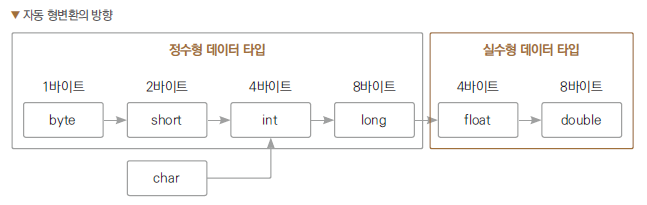

# 3장. 변수, 상수, 자료형의 형변환
***

## 3.1 변수
- 변수 : 값이 변하는 수

### 3.1.1 변수 선언 시 컴퓨터의 동작 원리
>```
>int num = 1;
>```
>이 코드에 대한 컴퓨터의 동작은 아래와 같다.
>1. 자료형이 int이니 메모리에 주소 네 개(4byte)를 확보해서 공간을 비워둠
><br>(이 때, 공간이 어딘지는 컴퓨터만 알면 된다.)
>2. 십진수 1을 이진수로 변경해 해당 공간에 저장
>3. 해당 공간(주소)을 변수 num에 기억

>```
>System.out.println(num);
>```
>이 코드에 대한 컴퓨터의 동작은 아래와 같다.
> 1. num 변수의 주소를 찾아감
> 2. 찾아낸 메모리의 시작 위치를 찾아감
> 3. num 변수가 int형이므로 4byte를 읽음
> 4. 또한 int형이므로 10진수로 바꿔서 숫자로 알려줌
><br>(이 때, char형이면 유니코드표를 보고 디코딩해서 문자로 알려준다.)

### 3.1.2 변수명 명명 방법
> 제약사항
> - 변수명은 숫자로 시작할 수 없다.
> - $와 _ 이외의 다른 특수문자는 변수의 이름에 사용할 수 없다.
> - 키워드(예약어)는 이름으로 사용할 수 없다.
><br> (ex : public, class, int, double 등등의 기 사용되는 단어)

> 권장사항
> - 소문자로 시작한다.
><br>(이렇게 하면 클래스의 이름이 대문자로 시작하는 것과 구별됨)
> - 변수에 사용되는 데이터를 유추할 수 있는 이름으로 만들어준다.
><br>(여러 단어를 카멜 표기법-camelCase 사용)

## 3.2 상수
- 상수 : 변하지 않는 값

### 3.2.1 리터럴
- 리터럴(literal) : 문자 뜻 그대로의 값을 의미한다.
- 문자 자체에 의미가 있어 누구나 공통으로 그 의미를 알고 그 의미를 변경할 수 없다.
- 통상적으로 변수에 대입하던 모든 숫자, 문자, 논리값(true, false)들이 리터럴이다.
- 리터럴은 프로그램이 시작할 때 특정 메모리 공간인 상수 풀(constant pool)에 자동으로 로딩된다.
- ex) `int num = 1;` 이란 문장을 사용하면 상수 풀에서 1을 복사해 num 변수에 대입

### 3.2.2 final 상수
### code : ch_3_0_final
- 프로그래머가 임의로 상수를 만들 때 사용하는 키워드
- final 상수 이름은 대문자를 이용해 만든다.
- 이런 경우 대소문자를 이용한 카멜 표기법을 사용할 수 없기 때문에, 단어 단위를 구분해 읽기 쉽게 언더바( _ )를 이용해 단어를 구분해준다.
- 변수명이 모두 대문자라 첫 글자가 소문자인 변수의 이름과 구분된다.
- 변수명이 모두 대문자라 단어의 첫 글자만 대문자인 클래스의 이름과 구분된다.
- final 상수는 변수처럼 값을 대입해 처음 값을 정하게 되지만, 상수의 성격상 다음에는 다른 값을 대입받아
바꿀 수 없다. 즉, 이 값이 '최종'이라는 의미로 final을 붙여놓은 것이다.
- 따라서 final 상수를 만들 때 값을 지정하지 않았다면 아직 최종값이 있는 것이 아니므로, 한 번은 대입할 수 있다.

## 3.3 자료형의 형변환
### 3.3.1 상수값 대입 시 형변환
### code : ch_3_1_TypeChange
- 정수형 리터럴 상수는 int형 처리가 기본(규칙)
- 실수형 리터럴 상수는 double형 처리가 기본(규칙)

|      주최      |  용어 1  |     용어 2     |
|:------------:|:------:|:------------:|
| 컴파일러(가 자동으로) | 자동 형변환 | 묵시적(암묵적) 형변환 |
| 프로그래머(가 직접)  | 강제 형변환 |   명시적 형변환    |

- 산술 연산에서 자동 형변환은 자료형의 크기가 큰 쪽으로 일어나거나, 정수형에서 실수형으로 일어난다.
- 그리고 자동 형변환은 컴파일러가 책임지지 않아도 되는 방향으로 형변환이 일어난다.

### code : ch_3_2_TypeChange2
```long num1 = 2147483648L;```
- 같은 정수형이더라도 long형 초기화시에는 값 뒤에 `L`을 붙여 long형으로 형변환함을 명시해야한다.
- L없이 단순 값으로 초기화시 컴파일러가 해당 값을 기본형인 int형이라고 인식하여 에러가 발생한다.

```float num2 = 1.0F;```
- 해당 코드도 마찬가지로 실수형 상수는 double형이 기본이므로, `F`를 붙여 형변환 해야한다.

```double num3 = 30;```
- int형의 상수 30이 double형의 상수 30.0으로 자동 형변환된 후 가장 근사치 값을 계산하여 double형의
변수에 대입한다.

### 3.3.2 연산 시 형변환
### code : ch_3_3_cal1, ch_3_4_cal2
- 산술 연산 시 CPU에는 기본 자료형 수를 계산하는 연산 장치가 있는데, 아래 표를 제외한 경우에는
전부 형변환해서 대입해야한다.

| 입력 1   | 입력 2 | 결과   |
|:-------|:-----|------|
| int    | int  | int  |
| long   | long | long |
| float  | float | float |
| double | double | double |

- 만약 입력 1과 2에 크기가 다른 자료형이 입력되면, 큰 쪽에 맞춰 먼저 형변환을 한 후 계산한다.
<br> (ex : byte와 short은 일단 다 작으니 int로 형변환 후 계산하게 됨)

## 마치며
1. 변수는 메모리 공간을 기억하는 용도로 사용된다.
2. 자바의 상수에는 리터럴 상수와 final 상수가 있다.
3. 자바 컴파일러는 정수형 리터럴 상수를 int형으로 처리한다
4. 자바 컴파일러는 실수형 리터럴 상수를 double형으로 처리한다.
5. 변수에 데이터를 대입할 때와 데이터끼리의 산술 연산을 할 때 형변환이 일어난다.