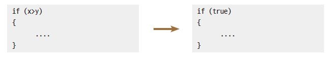

# 4장. 연산자
- 자바 프로그래밍에서 사용하는 산술, 대입, 비교, 증감, 논리 연산 등에 대해 알아보도록 한다.
***
## 4.1 산술 연산자
### code : ch_4_0_arith
| 연산자 | 설명       | 사용 예  | 결과 |
|:----|:---------|-------|----|
| +   | 더하기      | 5 + 2 | 7  |
| -   | 빼기       | 5 - 2 | 3  |
| *   | 곱하기      | 5 * 2 | 10 |
| /   | 나누기의 몫   | 5 / 2 | 2  |
| %   | 나누기의 나머지 | 5 % 2 | 1  |
- 나누기 결과로 몫만 나오는 이유는, CPU가 계산 시 두 정수를 입력받아 정수로 결과를 반환하는 구조이기 때문.

## 4.2 대입 연산자 & 복합 대입 연산자
### code : ch_4_1_assign
- 대입 연산자 : 오른쪽에 있는 연산식의 결과를 왼쪽의 변수에 저장
- 복합 대입 연산자 : 연산식과 대입을 합쳐서 작성함. 코드가 간결해지고 연산 시 자동 형변환이 수행된다.
  
| 연산자    | 설명 (다른 방법) |
|:-------|:-----------|
| a += b | a = a + b  |
| a -= b | a = a - b  |
| a *= b | a = a * b  |
| a /= b | a = a / b  |
| a %= b | a = a % b  |

## 4.3 부호 연산자 & 증감 연산자
### code : ch_4_2_pmsign, ch_4_3_prepostfix
- 부호 연산자 : 기본 자료형의 숫자 부호를 나타낼 때 사용
- 증감 연산자 : 변수의 값을 1 증가 혹은 감소시킬 때 사용
- 연산 이후에 형변환이 이루어지므로 연산자가 맞다.
<table>
    <tr>
        <th>연산자</th>
        <th>사용 예</th>
        <th>설명</th>
    </tr>
    <tr>
        <td>+</td>
        <td>+x</td>
        <td>부호 유지(의미없는 연산)</td>
    </tr>
    <tr>
        <td>-</td>
        <td>-x</td>
        <td>부호 반전</td>
    </tr>
    <tr>
        <td rowspan="2">++</td>
        <td>++x</td>
        <td>다른 연산 전 x값을 증가시킴 (전위 연산자)</td>
    </tr>
    <tr>
        <td>x++</td>
        <td>다른 연산 후 x값을 증가시킴 (후위 연산자)</td>
    </tr>
    <tr>
        <td rowspan="2">--</td>
        <td>--x</td>
        <td>다른 연산 전 x값을 감소시킴</td>
    </tr>
    <tr>
        <td>x--</td>
        <td>다른 연산 후 x값을 감소시킴</td>
    </tr>
</table>

## 4.4 비교 연산자(관계 연산자)
### code : ch_4_4_compare
- 비교 연산자 : 두 피연산자를 비교해 결괏값으로 논리값인 True / False를 반환해준다. 관계 연산자라고도 한다.
  
| 연산자 | 사용 예   | 설명             | 결과    |
|:----|:-------|----------------|-------|
| ==  | x == y | x와 y는 같다.      | false |
| !=  | x != y | x와 y는 같지 않다.   | true  |
| \>  | x > y  | x는 y보다 크다.     | true  |
| \>= | x >= y | x는 y보다 크거나 같다. | true  |
| <   | x < y  | x는 y보다 작다.     | false |
| <=  | x <= y | x는 y보다 작거나 같다. | false |

- if문이나 while문을 작성시 조건절을 사용하게 되는데, 이 때 조건절의 자리에 연산 결과가 들어가있다고 생각해야 한다.



if문은 단순히 조건절의 연산 결과인 true와 false만 확인한다.
<br>따라서 x>y라는 조건절의 비교 연산자가 연산 결과인 true나 false를 만들어 이후 로직을 수행 / 수행 방지시킨다.

## 4.5 논리 연산자
### code : ch_4_5_logical, ch_4_6_shortCircuitEvaluation
| 연산자                 | 기능                                       |
|---------------------|------------------------------------------|
| && <br> (논리곱, And)  | 두 항이 모두 참이면 결괏값은 참이다. <br> 그렇지 않은 경우 거짓이다. |
| \|\| <br> (논리합, Or) | 두 항 중 하나의 항이라도 참이면 결괏값은 참이다. <br> 두 항 모두 거짓이면 결괏값은 거짓이다. |
| ! <br> (부정, Not)    | 값이 참인 경우는 거짓으로 바뀐다. <br> 값이 거짓인 경우는 참으로 바뀐다. |

| A | B     | A && B | A \|\| B | !A    |
|-|-------|-|-|-------|
| true | true  | true | true | false |
| true | false | false | true | false |
| false | true  | false | true | true  |
| false | false  | false | false | true  |

- 주의할 점 : 연산의 효율 및 속도의 향상을 위해 불필요한 연산을 수행하지 않는 기능(Short-Circuit-Evaluation, SCE)로 인해,
논리곱에서는 둘 다 참이어야 참이 되므로 앞쪽이 거짓이면 뒤쪽 계산을 수행하지 않는다.
또한 논리합에서는 둘 중 하나라도 참이면 참이 되므로 앞쪽이 참이면 역시 뒤쪽 계산을 수행하지 않는다.

## 4.6 조건 연산자
### code : ch_4_7_condition
- 조건 연산자 : 조건식이 참 / 거짓인 경우에 따라 다른 결괏값을 나타내주는 연산자 (삼항 연산자에 해당)
```
조건식 ? 참일 때 실행 : 거짓일 때 실행;
```

## 4.7 단항/이항/삼항 연산자
- 단항 연산자 : ++x, y- -에서 ++, - -는 하나의 피연산자만으로 이루어진 식으로 연산을 수행한다. 이런 연산자를 단항 연산자라고 한다.
- 이항 연산자 : x + y 에서 + 연산자는 피연산자를 두 개 가지고 식을 구성하기 때문에 이항 연산자라고 한다.
- 삼항 연산자 : 삼항 연산자는 항이 세 개 있어야 한다. 우리가 앞서 배운 조건 연산자가 삼항
연산자이다. 삼항 연산자는 다음과 같이 표현한다.
```
1항 ? 2항 : 3항;
```

## 4.8 연산자 우선순위
### code : ch_4_8_order
| 우선순위 | 종류 | 연산자                                                                          |
|-----|----|------------------------------------------------------------------------------|
| 1   |    | .<sup>점</sup> [ ]<sup>대괄호</sup> ( )<sup>소괄호</sup>                            |
| 2   | 단항 | ++<sup>증가</sup> --<sup>감소</sup> !<sup>부정</sup> +<sup>부호</sup> -<sup>부호</sup> |
| 3   | 산술 | *<sup>곱하기</sup> /<sup>나누기 몫</sup> %<sup>나머지</sup>                            |
| 4   | 산술 | +<sup>더하기</sup> -<sup>빼기</sup>                                               |
| 5   | 비교 | <<sup>작다</sup> <=<sup>작거나 같다</sup> ><sup>크다</sup> >=<sup>크거나 같다</sup>        |
| 6   | 관계 | ==<sup>같다</sup> !=<sup>같지 않다</sup> |
| 7   | 논리곱 | &&<sup>and</sup> |
| 8   | 논리합 | \|\|<sup>or</sup> |
| 9   | 조건 | booleanExpression ? exp1 : exp2 |
| 10  | 대입 | = += -= *= /= %= |

## 마치며
1. 산술 연산자는 사칙연산 계산 기능을 하는 연산자이다.
2. 대입 연산자는 오른쪽에 있는 연산식의 결과를 왼쪽에 있는 변수에 저장한다.
3. 부호 연산자는 기본 자료형의 숫자 부호를 나타낼 때 사용하고, 증감 연산자는 변수의 값을 1
증가시키거나 1 감소시킬 때 사용한다.
4. 비교 연산자는 두 피연산자를 비교해 결괏값으로 true나 false를 반환해준다.
5. 논리 연산자는 논리 연산을 프로그래밍 언어로 표현한 연산자이다.
6. 조건 연산자는 주어진 조건식이 참인 경우와 거짓인 경우에 다른 결괏값을 나타내주는 연산자이다.
7. 자바는 단항, 이항, 삼항 연산자를 제공한다.
8. 연산자들은 연산을 수행함에 있어 우선순위를 가진다.